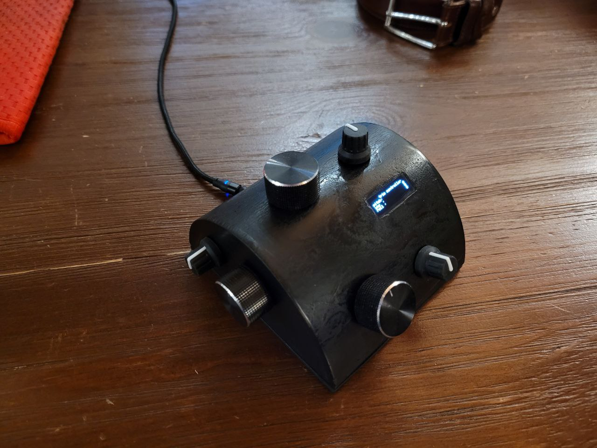
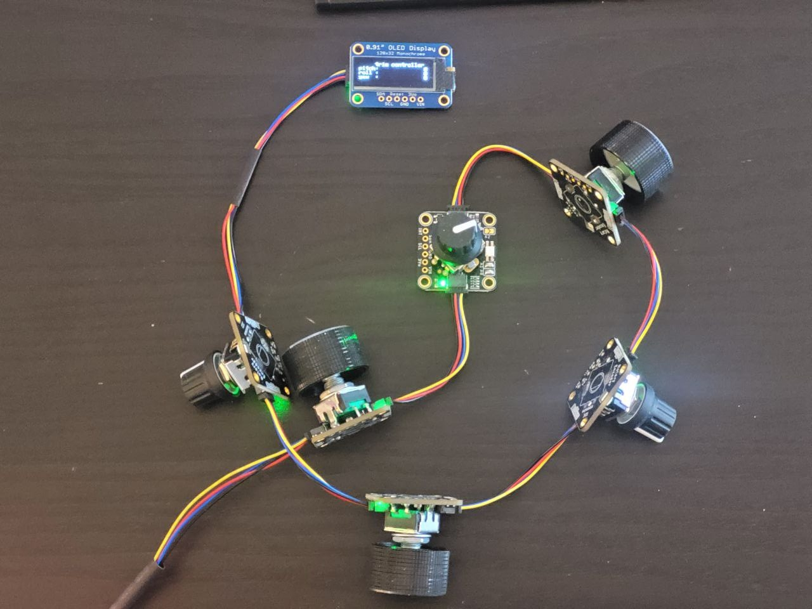

# A simple Pitch, Aileron, and Rudder trim controller firmware

See https://imgur.com/gallery/building-virtual-airplane-trim-controller-RWvABTn for the actual build

## Hardware

- Mini Arduino Leonardo ([KeeYees Pro Micro ATmega32U4](https://www.amazon.ca/gp/product/B07WPCLF8Y))
- six [Adafruit I2C rotary encoders](https://www.adafruit.com/product/4991)
- the tiny [Adafruit 128x32 I2C OLED](https://www.adafruit.com/product/4440)

## Software

Grab the [pitch-aileron-rudder.ino](pitch-aileron-rudder.ino) and drop it in the Arduino editor.

### Standard library requirements:

- Adafruit SSD1306 
- Adafruit GFX
- Adafruit Seesaw

### Custom library requirements:

- [Arduino Joystick Library](https://github.com/MHeironimus/ArduinoJoystickLibrary)

# License:

public domain, there's nothing even remotely special about this code.
